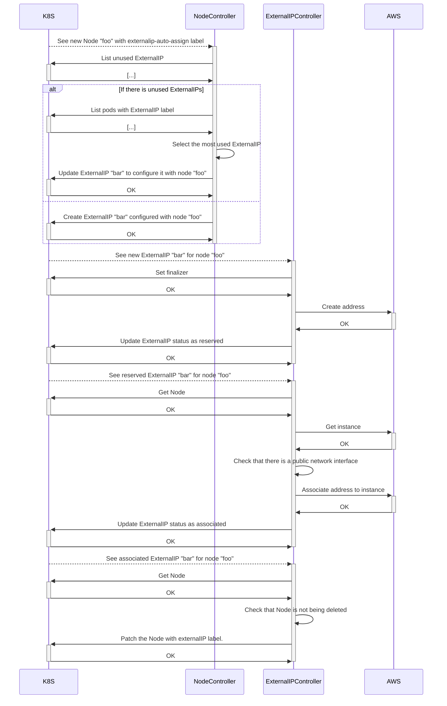

[![Quortex][logo]](https://quortex.io)

# kubestatic

An operator to manage the lifecycle of public cloud providers resources needed to expose endpoints on public nodes.

The standard use case for this tool is to provision external IPs on public nodes as well as firewall rules allowing to determine access permissions on these nodes.

## Prerequisites

### Kubernetes

A Kubernetes cluster of version v1.11.3+ is required. If you are just starting out with Kubestatic, it is highly recommended to use the latest version.

### AWS

To be used with AWS and interact with EC2 resources, an AWS account with the following permissions is required:

```json
{
  "Version": "2012-10-17",
  "Statement": [
    {
      "Sid": "AllObjectActions",
      "Effect": "Allow",
      "Action": [
        "ec2:DescribeSecurityGroups",
        "ec2:CreateSecurityGroup",
        "ec2:DeleteSecurityGroup",
        "ec2:AuthorizeSecurityGroupIngress",
        "ec2:RevokeSecurityGroupIngress",
        "ec2:AuthorizeSecurityGroupEgress",
        "ec2:RevokeSecurityGroupEgress",
        "ec2:DescribeAddresses",
        "ec2:AllocateAddress",
        "ec2:ReleaseAddress",
        "ec2:AssociateAddress",
        "ec2:DisassociateAddress",
        "ec2:DescribeInstances",
        "ec2:ModifyInstanceAttribute",
        "ec2:DescribeNetworkInterfaces",
        "ec2:ModifyNetworkInterfaceAttribute",
        "ec2:CreateTags"
      ],
      "Resource": "*"
    }
  ]
}
```

## Installation

### Helm

Follow Kubestatic documentation for Helm deployment [here](./helm/kubestatic).

## Usage

You can create resources via the CRDs documented below or by automatically assign external IPs to your nodes.

### CustomResourceDefinitions

Kubestatic acts on the following [custom resource definitions (CRDs)](https://kubernetes.io/docs/tasks/extend-kubernetes/custom-resources/custom-resource-definitions/):

**`ExternalIP`** An External IP will allow you to provision and attach an external IP to a node (only AWS ElasticIP supported at the moment). :warning: The nodes must be deployed on a public subnet.

**`FirewallRule`** A FirewallRule will allow you to configure inbound / outbound firewall rules and attach them to your nodes (only AWS EC2 Security Groups supported at the moment).

You can find examples of CRDs defined by Kubestatic [here](./config/samples).

Full API documentation is available [here](./docs/api-docs.asciidoc).

### ExternalIP auto assign

If you want to automatically attach an external IP to certain nodes of your cluster, simply add the following label to the nodes concerned `kubestatic.quortex.io/externalip-auto-assign: true`, Kubestatic will deploy an `ExternalIP` automatically for each of these nodes. If a reserved external IP already exists, Kubestatic will reuse the one associated with the highest number of pods, based on the label `kubestatic.quortex.io/externalip`.

Here is a sequence diagram describing how it works:



## Configuration

### Optional args

The kubestatic container takes as argument the parameters below.
| Key | Description | Default |
| ------------------------------------ | --------------------------------------------------------------------------------------------------------------------- | ------- |
| cloud-provider | Which cloud provider to deploy to. Available values: aws | "" |
| cluster-id | A required unique identifier used to track ownership of cloud resources. | `unset` |
| metrics-bind-address | The address the metric endpoint binds to. | :8080 |
| health-probe-bind-address | The address the probe endpoint binds to. | :8081 |
| leader-elect | Enable leader election for controller manager. Enabling this will ensure there is only one active controller manager. | `false` |
| prevent-eip-deallocation | Prevent EIP deallocation on nodes auto-assigned ExternalIPs. | `false` |
| node-min-reconciliation-interval | The minimum duration to wait between two reconciliations for the same node. | 10s |
| node-reconciliation-requeue-interval | The duration for which nodes are automatically reconciled. | 1m |
| vpc-id | The VPC ID to use. If not set, the VPC ID will be retrieved from the instance metadata. | "" |

## License

Distributed under the Apache 2.0 License. See `LICENSE` for more information.

## Versioning

We use [SemVer](http://semver.org/) for versioning.

## Help

Got a question?
File a GitHub [issue](https://github.com/quortex/kubestatic/issues).

[logo]: https://storage.googleapis.com/quortex-assets/logo.webp
